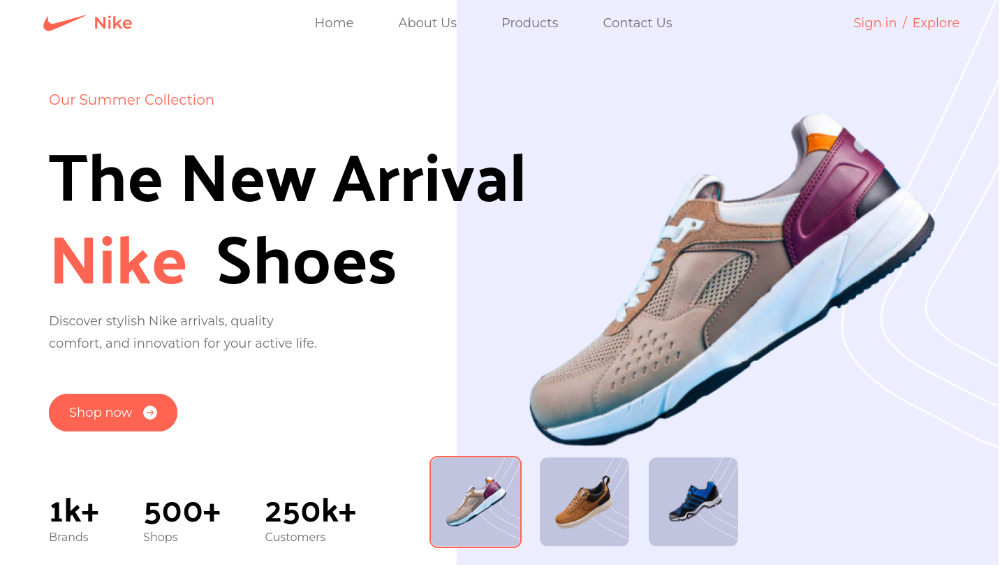

# Nike Landing Page built With Tailwind and React

## Table of Contents

- [Nike Landing Page built With Tailwind and React](#nike-landing-page-built-with-tailwind-and-react)
  - [Table of Contents](#table-of-contents)
  - [Overview](#overview)
    - [The Challenge](#the-challenge)
    - [Screenshot](#screenshot)
    - [Links](#links)
  - [My Process](#my-process)
    - [Built With](#built-with)
    - [What I Learned](#what-i-learned)
    - [Continued Development](#continued-development)
  - [Author](#author)

## Overview

### The Challenge

- View hover states for all interactive elements on the page
- Observe a live countdown timer that ticks down every second (start the count at 14 days)
- **Bonus**: Implement a feature where the card flips from the middle when a number changes

### Screenshot

### Links

- [GitHub Repository](https://github.com/ikmrn/nike-tailwind)
- [Live Demo](https://ikmrn-nike-tailwind.vercel.app/)

## My Process

### Built With

- Semantic HTML5 markup
- CSS custom properties
- Flexbox
- Tailwind CSS for styling
- React for interactivity
- Responsive design for mobile and desktop devices

### What I Learned

This project was my first experience using React, where I learned how to utilize React hooks such as `useState` and gained an understanding of how components work together to build dynamic user interfaces.

### Continued Development

I see React as a powerful tool for building dynamic and interactive web applications. Moving forward, I intend to deepen my understanding of React by exploring more advanced topics and best practices. I aim to leverage React's capabilities to create engaging user experiences and enhance my skills as a frontend developer.

## Author

- github - [@ikmrn](https://github.com/ikmrn)
